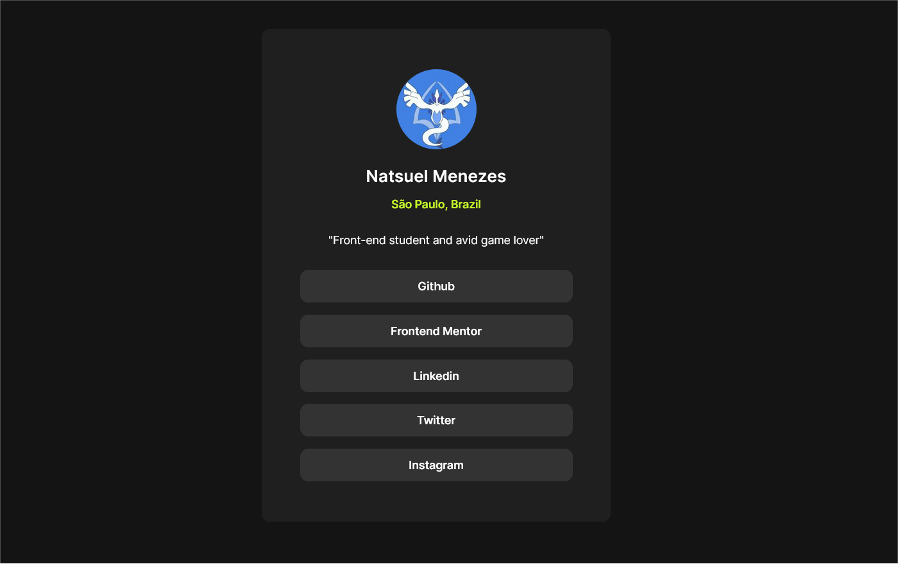
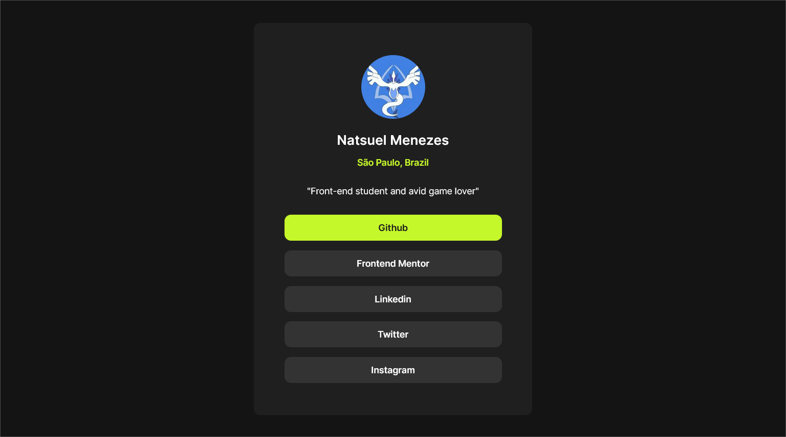
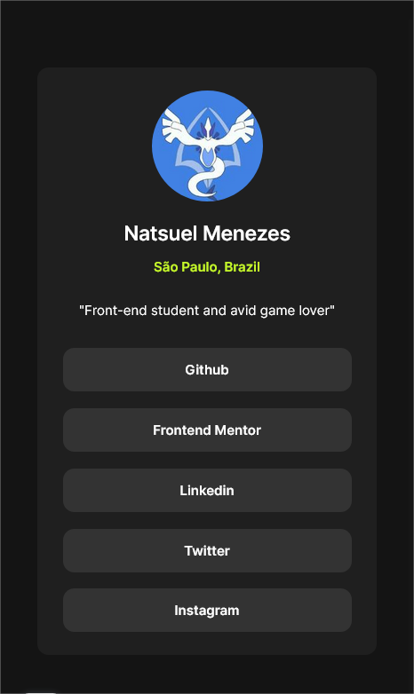
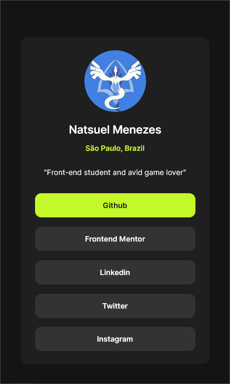

<h1 align="center">[ Profile Card ]</h1>

   
   

<h4 align="center">🚀 Concluido 🚀</h4>

---

Tabela de conteúdos
=================

   * Sobre o projeto
   * Tecnologias
   * Layout

---

## Sobre o Projeto

Projeto baseado em um desafio do Frontend Mentor, que consiste na criação de um layout que contém um cartão de perfil com minhas redes sociais.

---

## 🛠 Tecnologias utilizadas

- HTML
- CSS

---

## 🎨 Layout

### Web

 

### Mobile

 
